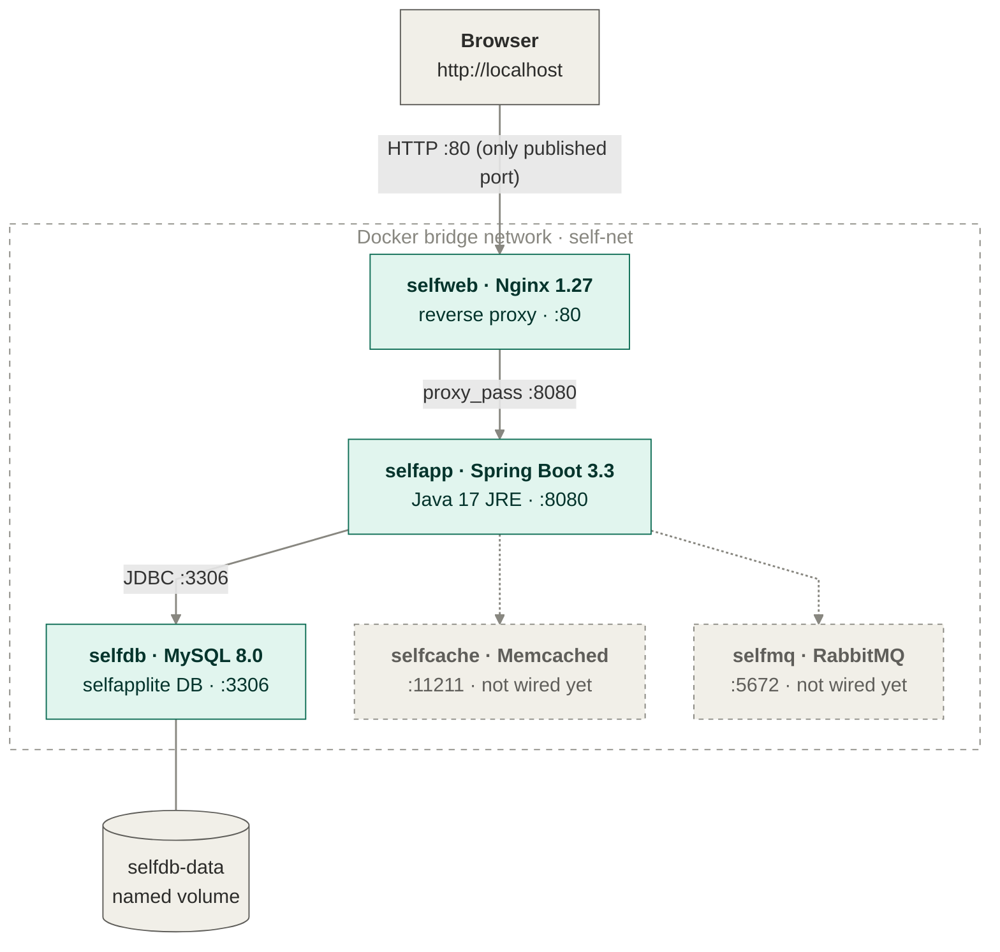
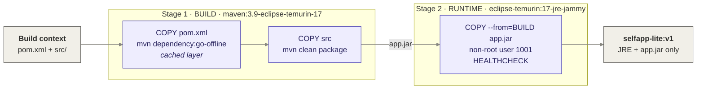

# docker-buildlab-selfapp

> A containerised three-tier Java web app (Nginx → Spring Boot → MySQL) built with
> multi-stage Dockerfiles and orchestrated with Docker Compose. The final app image
> ships only a JRE and the compiled `.jar`, runs as a non-root user and reports its
> own health. The whole stack comes up with one command and needs no external repo
> or SQL dump. Runs on any machine with Docker, including Apple Silicon Macs.

[](https://docs.docker.com/compose/)
[](./docker-compose.yml)
[](https://adoptium.net/)
[](https://spring.io/projects/spring-boot)
[](https://www.mysql.com/)
[](./LICENSE)

## What's in here

A small Spring Boot user-management app, written for this project, packaged as
Docker images and wired together with Docker Compose. Nginx is the only container
exposed to the host and reverse-proxies every request to the Spring Boot app,
which stores its data in MySQL on a named volume. Logging in as an admin lets you
add and delete users; a regular user can only view the list. The app image is
built in two stages, so Maven, the JDK and the source code never reach the image
that runs. Hibernate creates the database table on first start, so there is no
schema to import. Memcached and RabbitMQ are also part of the stack, ready for the
app to use as caching and messaging are added.

## Requirements

- **Docker Engine 24+** or **Docker Desktop**, with the **Compose v2** plugin
  (`docker compose version` should work)
- **~2 GB free RAM** for the five containers
- **Port 80 free** on the host
- *Optional:* a **Docker Hub** account, to publish the images

No local Java or Maven installation is needed: the build runs inside a container.

## Architecture

### Request flow (run time)



All five containers share the `self-net` bridge network and reach each other by
service name: Nginx forwards to `selfapp:8080`, and the app connects to `selfdb`
through the `DB_HOST` environment variable. Only Nginx publishes a port to the
host, so MySQL, Memcached and RabbitMQ are unreachable from outside the stack.
MySQL data lives in the `selfdb-data` volume and survives container restarts
and rebuilds.

### Build flow (build time)



Dependencies are downloaded in their own layer, before the source code is copied
in. Changing a Java file therefore only rebuilds the last layer, and Maven does
not re-download every dependency on each build.

### Service responsibilities

| Service | Image | Port | Role |
|---|---|---|---|
| `selfweb` | built from `web/` (Nginx 1.27 Alpine) | 80 → host | Reverse proxy, the only entry point |
| `selfapp` | built from `app/` (multi-stage, JRE 17) | 8080 (internal) | Spring Boot app: login, list, add and delete users |
| `selfdb` | `mysql:8.0` | 3306 (internal) | `selfapplite` database on the `selfdb-data` volume |
| `selfcache` | `memcached:1.6-alpine` | 11211 (internal) | Cache layer, reserved for the next iteration |
| `selfmq` | `rabbitmq:3.13-management-alpine` | 5672 (internal) | Message broker, reserved for the next iteration |

## Quick start

```bash
# 1. Clone the repo
git clone https://github.com/alexiglesias/docker-buildlab-selfapp.git
cd docker-buildlab-selfapp

# 2. (Optional) Set your Docker Hub username, used to tag the images
export DOCKERHUB_USER=your_username

# 3. Build both images (the first build downloads Maven dependencies)
docker compose build

# 4. Start the full stack in the background
docker compose up -d

# 5. Check that all five containers are running
docker compose ps

# 6. Open the application and log in (see credentials below)
open http://localhost        # macOS; on Linux use xdg-open, or just open the URL in your browser
```

On the first start MySQL initialises its data directory and Spring Boot creates
the `user` table, so the app takes around 30 seconds to become available.

## Application credentials

Demo-only users, held in memory by Spring Security:

| Username | Password | Role | Can do |
|---|---|---|---|
| `admin_self` | `admin_self` | ADMIN | View, add and delete users |
| `test_self` | `test_self` | USER | View the user list |

## Verifying the multi-stage build

```bash
# Compare the final app image with the Maven image it was built from
docker images | grep -E 'selfapp-lite|maven'

# Confirm there is no Maven and no source code in the runtime image
docker run --rm --entrypoint sh ${DOCKERHUB_USER:-yourname}/selfapp-lite:v1 -c 'ls /app; which mvn || echo "no maven"'

# Confirm the app runs as a non-root user
docker compose exec selfapp id
```

The runtime image contains only the JRE and `app.jar`, and `id` reports
`uid=1001`.

## Health checks

Both images define a Docker `HEALTHCHECK`:

- **`selfapp`** calls Spring Boot Actuator at `/actuator/health`. This is the only
  endpoint that is reachable without logging in.
- **`selfweb`** requests `/` from Nginx.

```bash
docker inspect --format '{{.State.Health.Status}}' selfapp selfweb
```

## Publish to Docker Hub

```bash
docker login
export DOCKERHUB_USER=your_username
docker compose build
docker compose push selfapp selfweb
```

This pushes `your_username/selfapp-lite:v1` and `your_username/selfapp-lite-web:v1`.

## Configuration

The app reads its database settings from environment variables, which are set in
`docker-compose.yml` and resolved in `application.properties`:

| Variable | Default | Purpose |
|---|---|---|
| `DB_HOST` | `selfdb` | MySQL hostname (the Compose service name) |
| `DB_PORT` | `3306` | MySQL port |
| `DB_NAME` | `selfapplite` | Database name, created automatically if missing |
| `DB_USER` / `DB_PASS` | `selfuser` / `selfpass` | Application database user |
| `DOCKERHUB_USER` | `yourname` | Docker Hub namespace used in the image tags |

## Troubleshooting

| Problem | Fix |
|---|---|
| `502 Bad Gateway` right after `docker compose up` | The app is still starting or waiting for MySQL. Wait 30 seconds, or follow it with `docker compose logs -f selfapp` |
| `bind: address already in use` on port 80 | Another service is using port 80. Change the mapping in `docker-compose.yml` to `"8080:80"` and open `http://localhost:8080` |
| Code changes don't show up | Rebuild the image: `docker compose up -d --build` |

## Stop / reset

```bash
docker compose stop        # stop the containers, keep them and their data
docker compose down        # remove the containers and network, keep the database volume
docker compose down -v     # also delete the selfdb-data volume (wipes all users)
```

## Project layout

```
docker-buildlab-selfapp/
├── docker-compose.yml                # 5 services, self-net network, selfdb-data volume
├── .dockerignore                     # keeps .git, target/ and docs out of the build context
├── .gitignore                        # Maven output, .env files, local AWS config
├── app/                              # selfapp: Spring Boot application
│   ├── Dockerfile                    # multi-stage: Maven build → JRE runtime, non-root, healthcheck
│   ├── pom.xml                       # Spring Boot 3.3, Web, JPA, Security, Actuator, Thymeleaf
│   └── src/main/
│       ├── java/com/example/selfapplite/
│       │   ├── SelfappLiteApplication.java  # entry point
│       │   ├── SecurityConfig.java          # form login, in-memory users, role-based access
│       │   ├── LoginController.java         # serves the login page
│       │   ├── UserController.java          # list, add and delete users (add/delete: ADMIN only)
│       │   ├── User.java                    # JPA entity
│       │   └── UserRepository.java          # Spring Data repository
│       └── resources/
│           ├── application.properties       # DB settings from env vars, ddl-auto=update
│           └── templates/
│               ├── index.html               # user list + admin form
│               └── login.html               # login form
└── web/                              # selfweb: Nginx reverse proxy
    ├── Dockerfile                    # nginx:1.27-alpine + config + healthcheck
    └── selfapp.conf                  # upstream selfapp:8080, forwards client headers
```

## Related projects

This repo is the base for the rest of the selfapp series:

- [`cicd-github-actions-selfapp`](https://github.com/alexiglesias/cicd-github-actions-selfapp):
  CI/CD pipeline that tests, builds, scans and deploys these images
- [`k8s-selfapp-minikube`](https://github.com/alexiglesias/k8s-selfapp-minikube):
  the same stack on Kubernetes, packaged as a Helm chart

## License

[MIT](./LICENSE)
