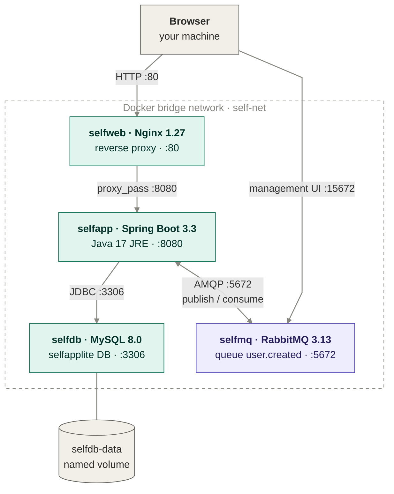
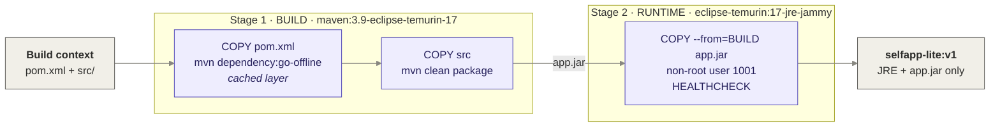

# docker-buildlab-selfapp

> A containerised three-tier Java web app (Nginx → Spring Boot → MySQL) with RabbitMQ
> messaging, built with multi-stage Dockerfiles and orchestrated with Docker Compose.
> Every service has a health check and starts only when its dependencies are healthy.
> The app image ships only a JRE and the compiled `.jar` and runs as a non-root user.
> Secrets stay in a git-ignored `.env`. Runs on any machine with Docker, including Apple Silicon Macs.

[](https://docs.docker.com/compose/)
[](./docker-compose.yml)
[](https://adoptium.net/)
[](https://spring.io/projects/spring-boot)
[](https://www.mysql.com/)
[](https://www.rabbitmq.com/)
[](./LICENSE)

## What's in here

A small Spring Boot user-management app, written for this project, packaged as Docker
images and wired together with Docker Compose. Nginx is the entry point and
reverse-proxies every request to the Spring Boot app, which stores users in MySQL on a
named volume. Logging in as an admin lets you add and delete users; a regular user can
only view the list. Every time a user is added, the app publishes a `user.created`
event to RabbitMQ and a listener in the app consumes and logs it.

The app image is built in two stages, so Maven, the JDK and the source code never reach
the image that runs. Compose starts the services in dependency order using health
checks, and Hibernate creates the database table on first start, so there is no schema
to import.

## Requirements

- **Docker Engine 24+** or **Docker Desktop**, with the **Compose v2** plugin
  (`docker compose version` should work)
- **~2 GB free RAM** for the four containers
- **Ports 80 and 15672 free** on the host
- *Optional:* a **Docker Hub** account, to publish the images

No local Java or Maven installation is needed: the build runs inside a container.

## Architecture

### Request and messaging flow (run time)



All four containers share the `self-net` bridge network and reach each other by service
name through Docker's internal DNS: Nginx forwards to `selfapp:8080`, and the app
connects to `selfdb` and `selfmq` through environment variables. From the host, only
two ports are reachable: 80 (Nginx) and 15672 (the RabbitMQ management UI). MySQL
(3306) and AMQP (5672) stay inside the network. MySQL data lives in the `selfdb-data`
volume and survives container restarts and rebuilds.

### Build flow (build time)



Dependencies are downloaded in their own layer, before the source code is copied in.
Changing a Java file therefore only rebuilds the last layers, and Maven does not
re-download every dependency on each build.

### Service responsibilities

| Service | Image | Port | Role |
|---|---|---|---|
| `selfweb` | built from `web/` (Nginx 1.27 Alpine) | 80 → host | Reverse proxy, the entry point for the app |
| `selfapp` | built from `app/` (multi-stage, JRE 17) | 8080 (internal) | Spring Boot app: login, list, add and delete users, publish and consume events |
| `selfdb` | `mysql:8.0` | 3306 (internal) | `selfapplite` database on the `selfdb-data` volume |
| `selfmq` | `rabbitmq:3.13-management-alpine` | 5672 (internal), 15672 → host | Message broker for `user.created` events, with the management UI |

## Quick start

```bash
# 1. Clone the repo
git clone https://github.com/alexiglesias/docker-buildlab-selfapp.git
cd docker-buildlab-selfapp

# 2. Create your .env from the template and set your own passwords
cp .env.example .env

# 3. Build both images (the first build downloads Maven dependencies)
docker compose build

# 4. Start the full stack in the background
docker compose up -d

# 5. Check that all four containers are healthy
docker compose ps

# 6. Open the application and log in (see credentials below)
open http://localhost        # macOS; on Linux use xdg-open, or just open the URL in your browser
```

On the first start MySQL initialises its data directory before it reports healthy, so
the whole stack takes around a minute to come up. Compose waits for each service
automatically.

## Application credentials

Demo-only users, held in memory by Spring Security:

| Username | Password | Role | Can do |
|---|---|---|---|
| `admin_self` | `admin_self` | ADMIN | View, add and delete users |
| `test_self` | `test_self` | USER | View the user list |

The RabbitMQ management UI at `http://localhost:15672` uses `RABBITMQ_USER` and
`RABBITMQ_PASS` from your `.env`.

## Messaging with RabbitMQ

When an admin adds a user, the app saves it to MySQL and then publishes a message to
the `user.created` queue. `UserCreatedListener`, running in the same app, consumes the
message and logs it. If RabbitMQ is unavailable, the user is still saved and the app
logs a warning instead of failing the request.

```bash
# After adding a user in the web UI, see the event being consumed
docker compose logs selfapp | grep user.created
```

In the management UI, open **Queues → user.created** to see the message rate. The
queue itself stays at zero messages, because the listener consumes each one
immediately.

The queue is declared durable, but the broker has no volume, so queues and messages
are recreated from scratch after `docker compose down`. That is intentional for a
demo; a persistent broker would mount a volume at `/var/lib/rabbitmq`.

## Health checks

Every service defines a health check, and Compose uses them to order startup:

| Service | Defined in | Check |
|---|---|---|
| `selfdb` | `docker-compose.yml` | `mysqladmin ping` over TCP (`127.0.0.1`), so it passes only once the real server is up, not the temporary one MySQL runs during initialisation |
| `selfmq` | `docker-compose.yml` | `rabbitmq-diagnostics ping` |
| `selfapp` | `app/Dockerfile` | Spring Boot Actuator at `/actuator/health`, which also includes the database and RabbitMQ connections |
| `selfweb` | `web/Dockerfile` | Requests `/` from Nginx |

```bash
docker inspect --format '{{.Name}} {{.State.Health.Status}}' selfdb selfmq selfapp selfweb

# Failure test: stop the broker and watch the app report DOWN
docker compose stop selfmq
curl http://localhost/actuator/health     # {"status":"DOWN"}
docker compose start selfmq
```

`/actuator/health` and `/login` are the only endpoints reachable without logging in.

## Verifying the multi-stage build

```bash
# Compare the final app image with the Maven image it was built from
docker images | grep -E 'selfapp-lite|maven'

# Confirm there is no Maven and no source code in the runtime image
docker run --rm --entrypoint sh ${DOCKERHUB_USER:-yourname}/selfapp-lite:v1 -c 'ls /app; which mvn || echo "no maven"'

# Confirm the app runs as a non-root user
docker compose exec selfapp id
```

The runtime image contains only the JRE and `app.jar`, and `id` reports `uid=1001`.

## Configuration

All settings come from `.env`, which Compose reads automatically. `.env` is git-ignored;
`.env.example` is the committed template. Compose stops with a clear error if a
required password is missing.

| Variable | Default | Purpose |
|---|---|---|
| `MYSQL_ROOT_PASSWORD` | *required* | MySQL root password |
| `DB_NAME` | `selfapplite` | Database name, created on first start |
| `DB_USER` | `selfuser` | Application database user |
| `DB_PASS` | *required* | Application database password |
| `RABBITMQ_USER` | `selfmq` | RabbitMQ user for the app and the management UI |
| `RABBITMQ_PASS` | *required* | RabbitMQ password |
| `DOCKERHUB_USER` | `yourname` | Docker Hub namespace used in the image tags |

The app receives these as `DB_*` and `MQ_*` environment variables and resolves them in
`application.properties`.

## Publish to Docker Hub

```bash
docker login
# set DOCKERHUB_USER=your_username in .env
docker compose build
docker compose push selfapp selfweb
```

This pushes `your_username/selfapp-lite:v1` and `your_username/selfapp-lite-web:v1`.

## Troubleshooting

| Problem | Fix |
|---|---|
| `required variable MYSQL_ROOT_PASSWORD is missing a value` | You haven't created `.env`. Run `cp .env.example .env` and set the passwords |
| `selfapp` is `unhealthy` and its logs show `Access denied for user 'selfuser'` | MySQL only reads its credentials when the volume is first created, so it still has the old password after you change `.env`. Reset it with `docker compose down -v`, then `docker compose up -d` |
| `bind: address already in use` on port 80 | Another service is using port 80. Change the mapping in `docker-compose.yml` to `"8080:80"` and open `http://localhost:8080` |
| Code changes don't show up | Rebuild the image: `docker compose up -d --build` |

## Stop / reset

```bash
docker compose stop        # stop the containers, keep them and their data
docker compose down        # remove the containers and network, keep the database volume
docker compose down -v     # also delete the selfdb-data volume (wipes all users)
```

## Project layout

```
docker-buildlab-selfapp/
├── docker-compose.yml                # 4 services, healthchecks, self-net network, selfdb-data volume
├── .env.example                      # template for .env (passwords, Docker Hub user)
├── .gitignore                        # .env, Maven output, .DS_Store
├── LICENSE
├── app/                              # selfapp: Spring Boot application
│   ├── Dockerfile                    # multi-stage: Maven build → JRE runtime, non-root, healthcheck
│   ├── .dockerignore                 # keeps target/ and local files out of the build context
│   ├── pom.xml                       # Spring Boot 3.3: Web, JPA, Security, Actuator, Thymeleaf, AMQP
│   └── src/main/
│       ├── java/com/example/selfapplite/
│       │   ├── SelfappLiteApplication.java  # entry point
│       │   ├── SecurityConfig.java          # form login, in-memory users, role-based access
│       │   ├── LoginController.java         # serves the login page
│       │   ├── UserController.java          # list, add, delete users; publishes user.created
│       │   ├── User.java                    # JPA entity
│       │   ├── UserRepository.java          # Spring Data repository
│       │   ├── RabbitConfig.java            # declares the durable user.created queue
│       │   └── UserCreatedListener.java     # consumes and logs user.created events
│       └── resources/
│           ├── application.properties       # DB and RabbitMQ settings from env vars, ddl-auto=update
│           └── templates/
│               ├── index.html               # user list + admin form
│               └── login.html               # login form
└── web/                              # selfweb: Nginx reverse proxy
    ├── Dockerfile                    # nginx:1.27-alpine + config + healthcheck
    └── selfapp.conf                  # upstream selfapp:8080, forwards client headers
```

## Related projects

This repo is the base for the rest of the selfapp series:

- [`cicd-github-actions-selfapp`](https://github.com/alexiglesias/cicd-github-actions-selfapp):
  CI/CD pipeline that tests, builds, scans and deploys these images
- [`k8s-selfapp-minikube`](https://github.com/alexiglesias/k8s-selfapp-minikube):
  the same stack on Kubernetes, packaged as a Helm chart

## License

[MIT](./LICENSE)
